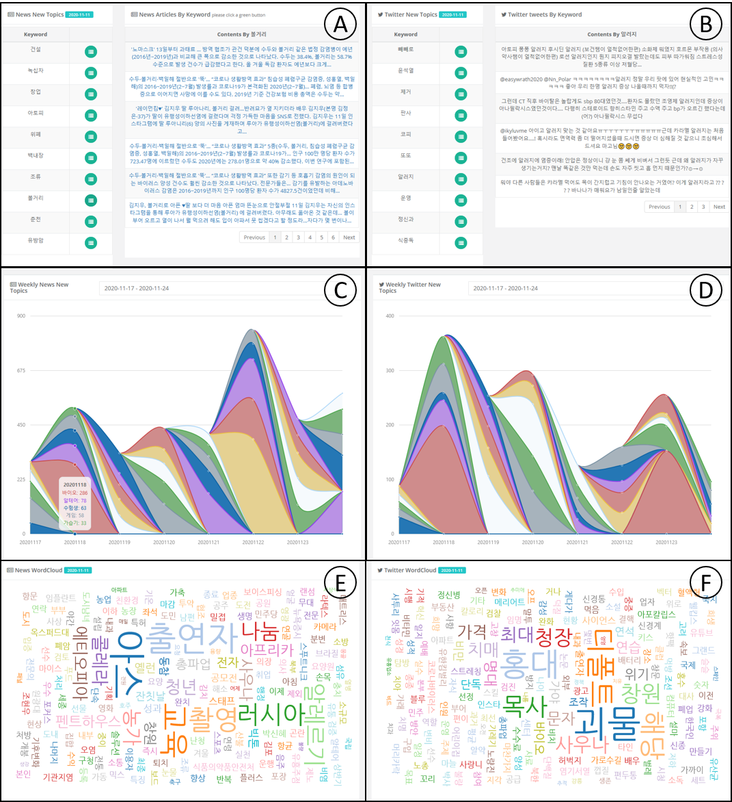

# Xproject

## 개요
| 프로젝트 명 | 주최/기관 | 기간 | 역할 | 기여도 |
| --------- | --------- | --- | --- | ----- | 
| 사용자 이동경로 기반 전염병 감염 정보 제공 시스템 개발| 과학기술정보통신부,상명대학교 | 2017.07 ~ 2019.06 | PE | 20% |

## Motivation
ICT·융합기술을 이용하여 전염병 예방과 확산을 방지 하는 방법은 없을까?

## 세부 개발 내용
- 질병과 연관된 뉴스, 트위터 데이터 수집
- 수집된 데이터로부터 질병 관련 이슈 키워드 추출
- 웹 페이지 구축 및 다양한 시각화 툴을 사용하여 사용자에게 정보 제공

## 결과
웹 페이지 구축: [http://www.epidemic.co.kr/media/newtopics](http://www.epidemic.co.kr/media/newtopics)

- A,B: 특정 날짜에 수집된 데이터에서 추출한 질병 관련 이슈 키워드 및 연관 뉴스 및 트윗
- C,D: 지정된 기간 동안 자주 등장한 질병 관련 키워드
- E, F: 질병 관련 이슈 키워드 순위에 따른 WordCloud

